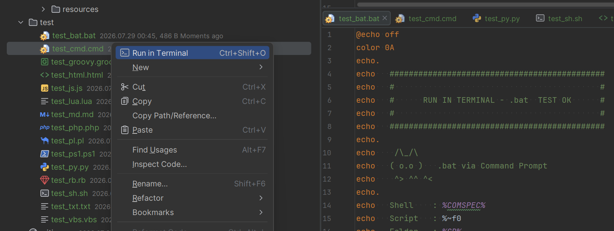
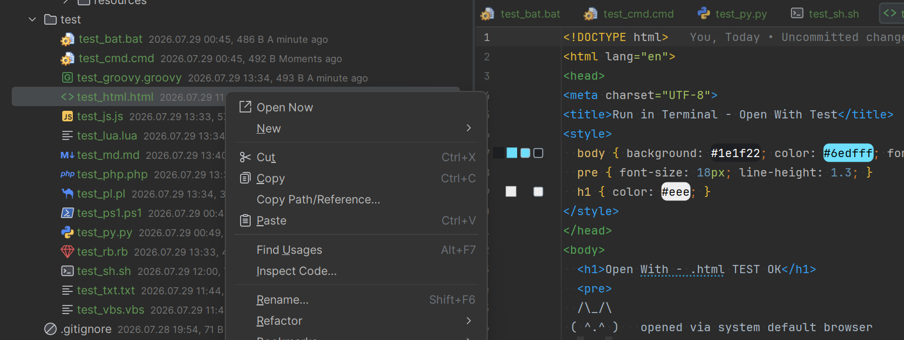
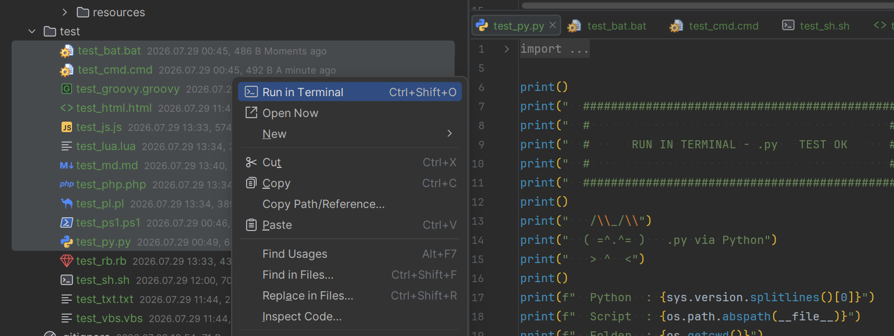
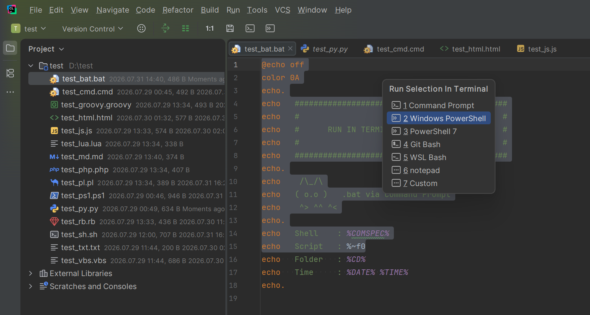
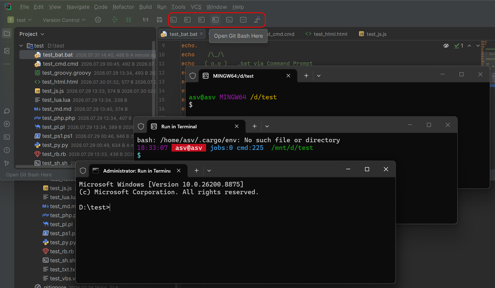
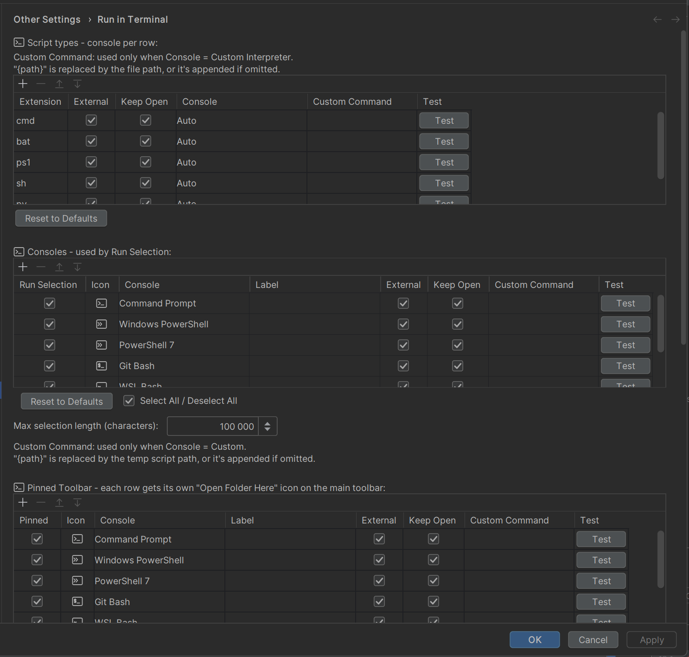
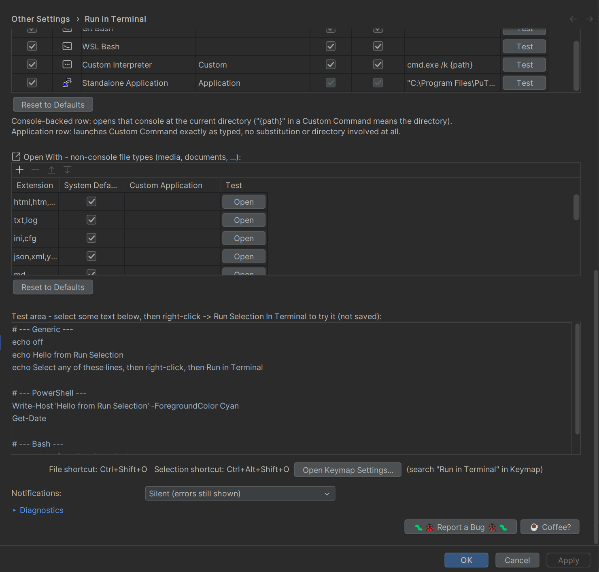

<picture>
  <source media="(prefers-color-scheme: dark)" srcset="images/pluginIcon_dark.png">
  
</picture>

# Run In Terminal — Issues

This repository is **only for bug reports and feature requests** for the
"Run In Terminal" JetBrains plugin (by alvol). It doesn't contain the
plugin's source code.

## What the plugin does

Run scripts or an editor selection in a real terminal / console / shell,
open a folder in your favorite console with one click from the toolbar, or
just open a file with its own (or a custom) application. Four entry points:

<picture><source media="(prefers-color-scheme: dark)" srcset="images/runInTerminalIcon_dark.png"></picture> **Run in Terminal** (project tree)
- Script files: `.bat`, `.cmd`, `.ps1`, `.sh`, `.py` by default — configurable per extension, comma-separated lists supported.
- Embedded Terminal tab, or a standalone external window — your choice per extension.
- cmd.exe, Windows PowerShell, PowerShell 7, Git Bash, WSL bash, or any custom interpreter command.
- Embedded tabs start the selected shell directly; external mode opens a separate OS window.
- "Keep Open" per row (on by default): keeps the console open after the script finishes.

### Remote Development (Windows Client + WSL Host)

- Leave **Client** unchecked to run on **Host** in the embedded IDE Terminal with native Linux paths and Host tools; check it to open a separate Windows window on **Client**.
- WSL paths are translated automatically for Windows applications. Explicit Git Bash means Git for Windows; WSL Bash and `Auto + .sh` use the WSL environment where appropriate.
- **Open Now** always launches the visible desktop application on Windows Client. A **Standalone Application** follows its Host/Client checkbox and works with any configured application.

<picture><source media="(prefers-color-scheme: dark)" srcset="images/runInTerminalIcon_dark.png"></picture> **Run Selection In Terminal** (editor)
- Right-click any text selection in the editor — no file needed — and run it in any of your enabled consoles. One enabled → runs directly; several → a submenu to pick which one.
- Its own "Consoles" settings table: five built-in consoles ship by default, but any row can be reassigned to any console kind, added, or removed — including a Custom Interpreter (an arbitrary command line) or a Standalone Application (launches a GUI app directly, no console wrapping at all).

<picture><source media="(prefers-color-scheme: dark)" srcset="images/runInTerminalIcon_dark.png"></picture> **Open Folder Here** (main toolbar)
- Pin your favorite consoles as individual icons on the main toolbar — one click opens that console at the current directory, nothing to run.
- Its own "Pinned Toolbar" settings table, same shape as Consoles above. A Standalone Application row here can also just launch a program directly, with the exact command line you typed.

<picture><source media="(prefers-color-scheme: dark)" srcset="images/openWithIcon_dark.png"></picture> **Open Now**
- Non-console files — media, documents, web pages, and more.
- System default application, or a custom one of your choice.
- Opens immediately — no picker dialog, no console involved.

**Also included:**
- A per-row "Test" button and icon picker on every table — for a Custom Interpreter/Standalone Application row, the icon can come straight from its own program automatically, or you can pick your own image (or borrow any other program's icon).
- Default shortcuts `Ctrl+Shift+O` (files) and `Ctrl+Alt+Shift+O` (selection), each with automatic conflict detection.
- Optional self-diagnostics report, including frontend/backend versions, build timestamps and loaded paths in Remote Development.
- Optional in-memory frontend/backend debug trace for diagnosing Remote Development routing; off by default.
- One **Reset All to Defaults** button with role-aware defaults: external windows for Local, Host execution for Remote Development.

**How to use:** right-click a file in the project tree or a text selection
in the editor, then pick *Run in Terminal*, *Run Selection In Terminal*, or
*Open Now*; or click a pinned console icon on the main toolbar for Open
Folder Here. Configure consoles/apps at
*Settings/Preferences → Other Settings → Run in Terminal*.

## Reporting a bug

1. Open the plugin's settings page (`Settings → Other Settings → Run in
   Terminal`) and click **Run Diagnostics...** — copy the report it
   generates. In Remote Development it identifies both loaded plugin copies,
   so please include the report rather than only the release number.
2. [Open a new issue](https://github.com/alvolturbo/run-in-terminal-issues/issues/new)
   here and paste that report in, along with what you did and what you
   expected to happen instead.

## Support

Found this useful? There's a "☕ Coffee?" button on the plugin's settings
page, linking to [ko-fi.com/alvol](https://ko-fi.com/alvol) — entirely
optional.
